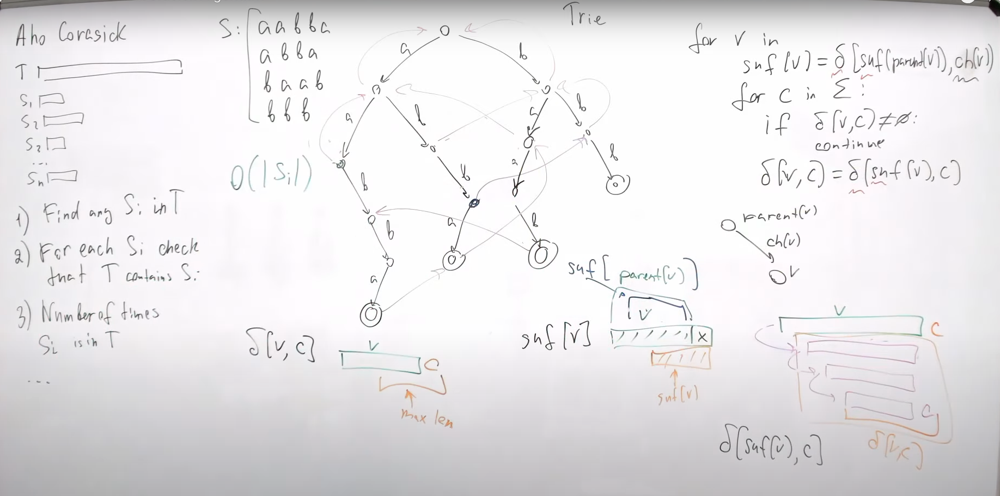
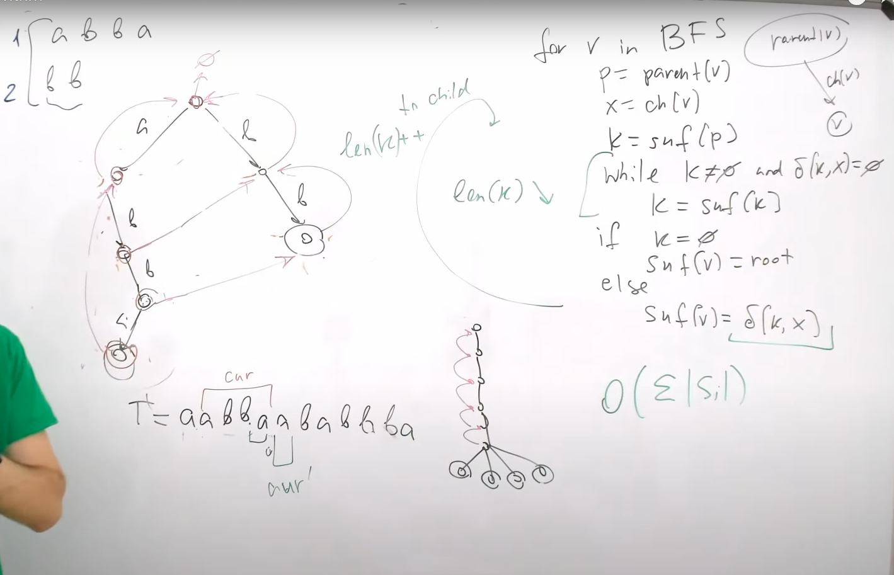

# Aho Corasick Algorithm

### Suffix links
Basically, For all prefix(State) of strings => we find maximum suffix which is prefix of some(can be other) string. 

So in KMP, We had only one string here we have multiple strings to search prefix.

 
## Using Transition array and suffix links

## Using only suffix links
basically, Idea is same as KMP only difference is, here we follow suffix link of parents until we find transition to accept current char

### Reference: https://youtu.be/w9-n3jW7q3s