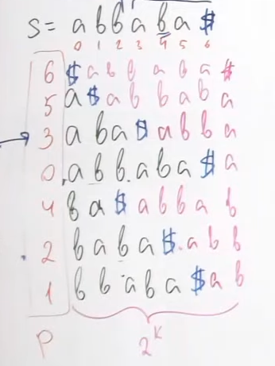
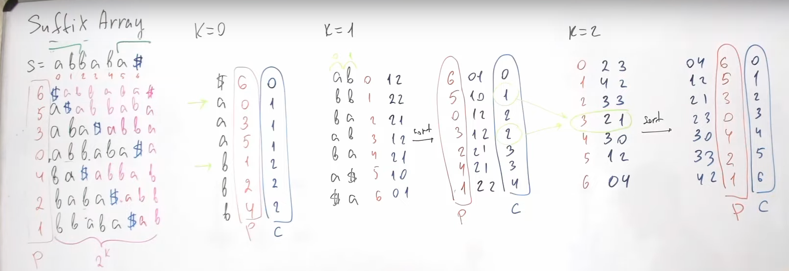
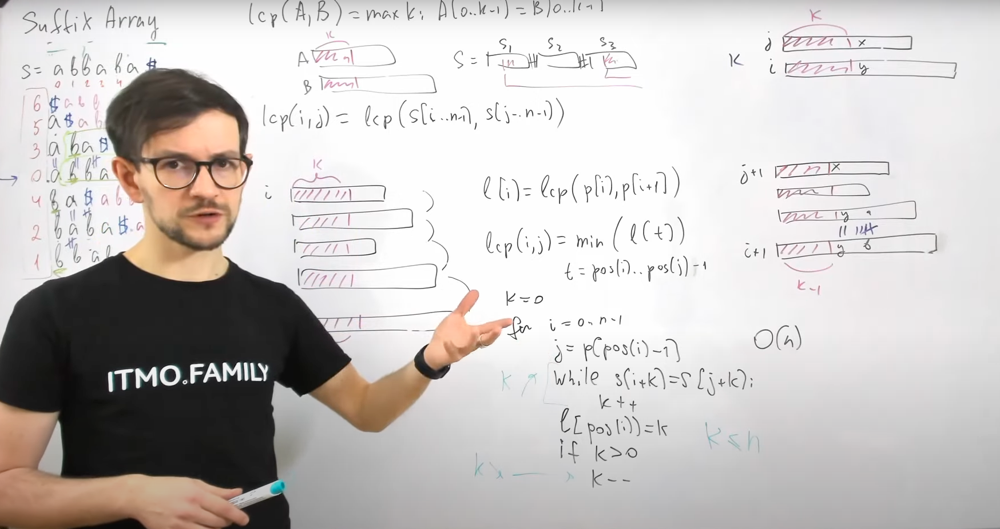

# Suffix Array

> Generally, Suffix Array is being used in SubString related problems as suffix of prefix represent sub-string




### Sort [i...i+2^k-1] (in cycle)

```
phase k: sort S[i...i+2^k-1]

if k=0 => one char

if we have computed k, 
then for k = k+1

A = [   A1-2^k   ] [   A2-2^k   ]
B = [   B1-2^k   ] [   B2-2^k   ]

 A < B = ( A1 < B1 or ( A1 = B1 and A2 < B2 ))
 ```

 > Complexity: (nlogn + logn * nlogn) ~ (n log^2 n) 

 this can be improved using radix sort we're just comparing two small pairs.

### Dry Run of Algo to build Suffix array
 

## Longest common prefix of two suffix
```
lcp(i,j) = lcp(s[i..n-1], s[j...n-1]) 

l[i] = lcp( p[i],p[i+1] ) = lcp of two consecutive suffixs in suffix array

lcp(i,j) = min (l[t]). where t = position i to j in suffix array

```
 

Reference: https://youtu.be/dpu0RDXZAH0?list=PLrS21S1jm43igE57Ye_edwds_iL7ZOAG4&t=4661
When I do CSS: https://youtu.be/dpu0RDXZAH0?list=PLrS21S1jm43igE57Ye_edwds_iL7ZOAG4&t=3420
